# 📚 Documentación Completa del Proyecto Betania

## 📋 Índice

1. [Información General](#información-general)
2. [Arquitectura del Sistema](#arquitectura-del-sistema)
3. [Base de Datos (SQL)](#base-de-datos-sql)
4. [Backend (Python/Flask)](#backend-pythonflask)
5. [Frontend (HTML/CSS/JavaScript)](#frontend-htmlcssjavascript)
6. [Instalación y Configuración](#instalación-y-configuración)
7. [Flujos de Trabajo](#flujos-de-trabajo)

---

## 📌 Información General

**Betania** es un sistema web de gestión de asistencias y participación para grupos y comunidades. Permite a los usuarios:

- Registrarse y autenticarse de forma segura
- Crear y unirse a grupos
- Tomar asistencia
- Gestionar puntos y medallas
- Ver rankings globales
- Celebrar cumpleaños de miembros

### Tecnologías Principales

- **Backend**: Python 3.x + Flask
- **Base de Datos**: MySQL (MariaDB)
- **Frontend**: HTML5, CSS3, JavaScript (Vanilla)
- **Autenticación**: JWT (JSON Web Tokens) + Sessions
- **Seguridad**: Flask-Limiter (rate limiting), Werkzeug (password hashing)

---

## 🏗️ Arquitectura del Sistema

### Estructura de Directorios

```
reunion/
├── app.py                    # Punto de entrada principal
├── requirements.txt          # Dependencias Python
├── SQL.sql                   # Script de creación de BD
│
├── CONFIGURACION/            # Configuración de la aplicación
│   ├── __init__.py
│   └── config.py            # Parámetros de conexión DB
│
├── DB/                       # Capa de base de datos
│   ├── __init__.py
│   └── conexion.py          # Conexión a MySQL
│
├── MODELS/                   # Modelos de datos
│   ├── __init__.py
│   ├── Usuario.py           # Modelo Usuario
│   └── Grupo.py             # Modelo Grupo
│
├── QUERYS/                   # Consultas SQL organizadas
│   ├── queryUsuario.py
│   ├── queryGrupo.py
│   ├── queryAsistencias.py
│   ├── queryMedallas.py
│   ├── queryPuntos.py
│   ├── queryRol.py
│   ├── querysAdmin.py
│   ├── querysCrearGrupo.py
│   ├── querysCumpleanos.py
│   ├── querysDashboard.py
│   ├── querysRaking.py
│   ├── querysRegistro.py
│   └── querysUnirGrupo.py
│
├── FUNCIONES/                # Utilidades y decoradores
│   ├── __init__.py
│   ├── Decoradores.py       # @login_required, @admin_required, etc.
│   └── Funciones.py         # Funciones auxiliares
│
├── JWT/                      # Gestión de tokens JWT
│   ├── __init__.py
│   └── JWT.py               # Creación y validación de tokens
│
├── RUTAS/                    # Blueprints y rutas
│   ├── dashboard_ruta.py
│   ├── grupo_ruta.py
│   ├── register_ruta.py
│   ├── login_ruta.py
│   ├── crear_grupo_ruta.py
│   ├── unirse_grupo_ruta.py
│   ├── cumpleanos_ruta.py
│   ├── ranking_ruta.py
│   ├── configuraciones_usuarios_rutas.py
│   ├── tema_ruta.py
│   ├── ajustar_puntos_ruta.py
│   ├── gestionar_medallas_ruta.py
│   ├── perfil_ruta.py
│   ├── asistencia_ruta.py
│   ├── subir_imagen_ruta.py
│   └── JWT_ruta.py
│
├── templates/                # Plantillas HTML (Jinja2)
│   ├── base.html            # Plantilla base
│   ├── 404.html             # Página de error
│   ├── inicio/              # Login y registro
│   ├── user_view/           # Vistas de usuario
│   ├── creador/             # Vistas de creador de grupos
│   ├── gestionar/           # Gestión de puntos y medallas
│   └── config/              # Configuración de usuario
│
└── static/                   # Archivos estáticos
    ├── css/                 # Estilos CSS
    │   ├── style.css
    │   ├── base/
    │   ├── dark/            # Tema oscuro
    │   ├── light/           # Tema claro
    │   └── toast/           # Notificaciones
    ├── js/                  # JavaScript
    │   ├── menu.js
    │   ├── toast.js
    │   └── barba.js
    ├── iconos/              # Iconos SVG
    └── logos/               # Logos de la aplicación
```

### Patrón de Arquitectura

El proyecto sigue una **arquitectura en capas**:

1. **Capa de Presentación** (`templates/`, `static/`)
2. **Capa de Rutas** (`RUTAS/`, `app.py`)
3. **Capa de Lógica de Negocio** (`QUERYS/`, `FUNCIONES/`)
4. **Capa de Datos** (`MODELS/`, `DB/`)
5. **Capa de Persistencia** (MySQL)

---

## 🗄️ Base de Datos (SQL)

### Diagrama de Entidades


### Tablas Principales

#### 1. **usuarios**
Almacena la información de todos los usuarios del sistema.

```sql
CREATE TABLE `usuarios` (
  `id` int(11) NOT NULL AUTO_INCREMENT,
  `nombre` varchar(100) NOT NULL,
  `email` varchar(100) NOT NULL,
  `fecha_nacimiento` date DEFAULT NULL,
  `password` varchar(255) NOT NULL,
  `puntos` int(11) DEFAULT 0,
  `racha` int(11) DEFAULT 0,
  `tema` bit(1) DEFAULT 0,
  `fecha_registro` datetime DEFAULT current_timestamp(),
  `rol_id` int(11) DEFAULT NULL,
  PRIMARY KEY (`id`),
  UNIQUE KEY `email` (`email`),
  KEY `idx_email` (`email`),
  KEY `idx_puntos` (`puntos`),
  KEY `fk_rol` (`rol_id`),
  CONSTRAINT `fk_rol` FOREIGN KEY (`rol_id`) REFERENCES `roles` (`id`)
) ENGINE=InnoDB DEFAULT CHARSET=utf8mb4 COLLATE=utf8mb4_unicode_ci;
```

**Campos importantes:**
- `puntos`: Sistema de gamificación
- `racha`: Días consecutivos de asistencia
- `tema`: 0 = claro, 1 = oscuro
- `rol_id`: Referencia a tabla `roles` (usuario, líder, admin)

#### 2. **grupos**
Representa los grupos/comunidades creados.

```sql
CREATE TABLE `grupos` (
  `id` int(11) NOT NULL AUTO_INCREMENT,
  `nombre` varchar(100) NOT NULL,
  `descripcion` text DEFAULT NULL,
  `admin_id` int(11) NOT NULL,
  `codigo_invitacion` varchar(20) NOT NULL,
  `fecha_creacion` datetime DEFAULT current_timestamp(),
  PRIMARY KEY (`id`),
  UNIQUE KEY `codigo_invitacion` (`codigo_invitacion`),
  KEY `admin_id` (`admin_id`),
  CONSTRAINT `grupos_ibfk_1` FOREIGN KEY (`admin_id`) REFERENCES `usuarios` (`id`) ON DELETE CASCADE
) ENGINE=InnoDB DEFAULT CHARSET=utf8mb4 COLLATE=utf8mb4_unicode_ci;
```

**Campos importantes:**
- `admin_id`: Usuario creador/administrador del grupo
- `codigo_invitacion`: Código único para unirse al grupo

#### 3. **asistencias**
Registra la asistencia de usuarios a grupos.

```sql
CREATE TABLE `asistencias` (
  `id` int(11) NOT NULL AUTO_INCREMENT,
  `usuario_id` int(11) NOT NULL,
  `grupo_id` int(11) NOT NULL,
  `fecha` date NOT NULL,
  `presente` tinyint(1) DEFAULT 1,
  `fecha_registro` datetime DEFAULT current_timestamp(),
  PRIMARY KEY (`id`),
  UNIQUE KEY `unique_asistencia` (`usuario_id`,`grupo_id`,`fecha`),
  KEY `grupo_id` (`grupo_id`),
  CONSTRAINT `asistencias_ibfk_1` FOREIGN KEY (`usuario_id`) REFERENCES `usuarios` (`id`) ON DELETE CASCADE,
  CONSTRAINT `asistencias_ibfk_2` FOREIGN KEY (`grupo_id`) REFERENCES `grupos` (`id`) ON DELETE CASCADE
) ENGINE=InnoDB DEFAULT CHARSET=utf8mb4 COLLATE=utf8mb4_unicode_ci;
```

**Restricción única:** Un usuario solo puede tener una asistencia por día por grupo.

#### 4. **medallas**
Sistema de logros/reconocimientos.

```sql
CREATE TABLE `medallas` (
  `id` int(11) NOT NULL AUTO_INCREMENT,
  `nombre` varchar(100) NOT NULL,
  `descripcion` text DEFAULT NULL,
  `imagen` varchar(255) NOT NULL,
  `fecha_creacion` datetime DEFAULT current_timestamp(),
  PRIMARY KEY (`id`)
) ENGINE=InnoDB DEFAULT CHARSET=utf8mb4 COLLATE=utf8mb4_unicode_ci;
```

#### 5. **roles**
Define los niveles de permisos.

```sql
CREATE TABLE `roles` (
  `id` int(11) NOT NULL AUTO_INCREMENT,
  `nombre` varchar(50) NOT NULL,
  PRIMARY KEY (`id`),
  UNIQUE KEY `nombre` (`nombre`)
) ENGINE=InnoDB DEFAULT CHARSET=utf8mb4 COLLATE=utf8mb4_unicode_ci;
```

**Roles típicos:**
- `usuario`: Miembro regular
- `lider`: Puede crear grupos
- `admin`: Acceso total al sistema

### Índices y Optimización

- **Índices únicos**: `email`, `codigo_invitacion`
- **Índices de búsqueda**: `idx_email`, `idx_puntos`, `idx_fecha`, `idx_codigo`
- **Claves foráneas**: Todas con `ON DELETE CASCADE` para integridad referencial

---

## 🐍 Backend (Python/Flask)

### Archivo Principal: `app.py`

```python
from flask import Flask, render_template, request, redirect, url_for, session, flash, jsonify
from flask_limiter import Limiter
from flask_jwt_extended import JWTManager
from datetime import timedelta

app = Flask(__name__)
app.secret_key = 'una_clave_secreta_larga_y_unica'
app.permanent_session_lifetime = timedelta(days=10)

# Configuración JWT
app.config['JWT_SECRET_KEY'] = 'jsabebJSKAEAVKHA1U3Y6HSHA'
app.config['JWT_ACCESS_TOKEN_EXPIRES'] = timedelta(minutes=15)
app.config['JWT_TOKEN_LOCATION'] = ['cookies']
jwt = JWTManager(app)

# Rate Limiting
limiter = Limiter(
    app=app,
    key_func=get_remote_address,
    default_limits=["200 per day", "50 per hour"]
)
```

### Modelos de Datos

#### `MODELS/Usuario.py`

```python
class Usuario:
    def __init__(self, id=None, nombre=None, email=None, password=None, 
                 fecha_nacimiento=None, rol_id=None, tema=None, puntos=None, 
                 racha=None, fecha_registro=None):
        self.id = id
        self.nombre = nombre
        self.email = email
        self.password = password
        self.fecha_nacimiento = fecha_nacimiento
        self.rol_id = rol_id
        self.tema = tema
        self.puntos = puntos if puntos else 0
        self.racha = racha if racha else 0
        self.fecha_registro = fecha_registro
    
    @classmethod
    def from_dict(cls, data):
        """Crea un Usuario desde un diccionario de la BD"""
        if not data:
            return None
        return cls(
            id=data.get('id'),
            nombre=data.get('nombre'),
            email=data.get('email'),
            # ... más campos
        )
    
    def to_dict(self):
        """Convierte el Usuario a diccionario"""
        return {
            'id': self.id,
            'nombre': self.nombre,
            'email': self.email,
            # ... más campos
        }
```

#### `MODELS/Grupo.py`

```python
from datetime import datetime

class Grupo:
    def __init__(self, nombre, descripcion, admin_id, codigo_invitacion, 
                 creado_por=None, fecha_creacion=None):
        self.nombre = nombre
        self.descripcion = descripcion
        self.admin_id = admin_id
        self.codigo_invitacion = codigo_invitacion
        self.creado_por = creado_por if creado_por is not None else admin_id
        self.fecha_creacion = fecha_creacion if fecha_creacion is not None else datetime.now()
    
    def to_tuple(self):
        return (
            self.nombre,
            self.descripcion,
            self.admin_id,
            self.codigo_invitacion,
            self.fecha_creacion
        )
```

### Conexión a Base de Datos

#### `DB/conexion.py`

```python
import pymysql
from pymysql.cursors import DictCursor
from CONFIGURACION.config import data

def get_connection():
    """
    Devuelve una conexión a la base de datos.
    Usa DictCursor por defecto para obtener resultados como diccionarios.
    """
    return pymysql.connect(
        host=data['host'],
        user=data['user'],
        password=data['password'],
        database=data['database'],
        charset=data.get('charset', 'utf8mb4'),
        cursorclass=DictCursor
    )
```

**Patrón de uso:**
```python
connection = get_connection()
try:
    with connection.cursor() as cursor:
        cursor.execute("SELECT * FROM usuarios WHERE id = %s", (user_id,))
        user = cursor.fetchone()
finally:
    connection.close()
```

### Decoradores de Seguridad

#### `FUNCIONES/Decoradores.py`

```python
from functools import wraps
from flask import session, redirect, url_for, flash

def login_required(f):
    """Requiere que el usuario esté autenticado"""
    @wraps(f)
    def decorated_function(*args, **kwargs):
        if 'user_id' not in session:
            flash('Debes iniciar sesión para acceder a esta página', 'warning')
            return redirect(url_for('login'))
        return f(*args, **kwargs)
    return decorated_function

def admin_required(f):
    """Requiere rol de administrador"""
    @wraps(f)
    def decorated_function(*args, **kwargs):
        if session.get('rol_name') != 'admin':
            flash('No tienes permisos de administrador', 'danger')
            return redirect(url_for('dashboard'))
        return f(*args, **kwargs)
    return decorated_function

def lideres_required(f):
    """Requiere rol de líder o admin"""
    @wraps(f)
    def decorated_function(*args, **kwargs):
        if session.get('rol_name') not in ['lider', 'admin']:
            flash("No tienes permiso para acceder a esta página", "danger")
            return redirect(url_for('dashboard'))
        return f(*args, **kwargs)
    return decorated_function

def grupo_admin_required(f):
    """Verifica que el usuario sea admin del grupo específico o admin global"""
    @wraps(f)
    def decorated_function(*args, **kwargs):
        if 'user_id' not in session:
            flash('Debes iniciar sesión', 'warning')
            return redirect(url_for('login'))

        grupo_id = kwargs.get('grupo_id')
        if not grupo_id:
            flash('Grupo no especificado', 'error')
            return redirect(url_for('dashboard'))

        connection = get_connection()
        try:
            with connection.cursor() as cursor:
                # Verificar si es admin global
                cursor.execute("SELECT rol_id FROM usuarios WHERE id = %s", (session['user_id'],))
                user = cursor.fetchone()
                if user:
                    cursor.execute("SELECT nombre FROM roles WHERE id = %s", (user['rol_id'],))
                    rol = cursor.fetchone()
                    if rol and rol['nombre'] == 'admin':
                        return f(*args, **kwargs)

                # Verificar si es admin del grupo
                cursor.execute("SELECT admin_id FROM grupos WHERE id = %s", (grupo_id,))
                grupo = cursor.fetchone()
                if grupo and str(grupo['admin_id']) == str(session['user_id']):
                    return f(*args, **kwargs)

                flash('No tienes permisos para gestionar este grupo', 'error')
                return redirect(url_for('ver_grupo', grupo_id=grupo_id))

        finally:
            connection.close()

    return decorated_function
```

### Sistema JWT

#### `JWT/JWT.py`

```python
from flask_jwt_extended import (
    create_access_token, create_refresh_token, 
    jwt_required, verify_jwt_in_request, get_jwt_identity,
    unset_jwt_cookies, set_access_cookies
)
from datetime import timedelta
import logging
from functools import wraps
from flask import flash, redirect, url_for, make_response

def crear_access_token(id_usuario: int):
    """Crea un token de acceso JWT"""
    logging.info(f"Creando token para el usuario {id_usuario}")
    try:
        id_str = str(id_usuario)
        access_token = create_access_token(
            identity=id_str, 
            expires_delta=timedelta(hours=1)
        )
        return access_token
    except Exception as e:
        logging.error(f"Error al crear token: {str(e)}")
        return None

def verificar_y_renovar_token(f):
    """
    Decorador que verifica el token y lo renueva automáticamente si es necesario
    """
    @wraps(f)
    def decorated_function(*args, **kwargs):
        try:
            # Intentar verificar el token actual
            verify_jwt_in_request()
            user_id = get_jwt_identity()
            logging.info(f"Token válido para usuario: {user_id}")
            
            # Token válido, continuar
            return f(*args, **kwargs)
            
        except Exception as e:
            error_msg = str(e)
            logging.warning(f"Token inválido/expirado: {error_msg}")
            
            # Si el token expiró, intentar renovarlo
            if 'expired' in error_msg.lower():
                try:
                    # Verificar el refresh token
                    verify_jwt_in_request(refresh=True)
                    user_id = get_jwt_identity()
                    
                    # Crear nuevo access token
                    new_access_token = create_access_token(identity=user_id)
                    
                    # Establecer nueva cookie y continuar
                    response = make_response(f(*args, **kwargs))
                    set_access_cookies(response, new_access_token)
                    
                    logging.info(f"Token renovado automáticamente para: {user_id}")
                    return response
                    
                except Exception as refresh_error:
                    # El refresh token también expiró
                    logging.error(f"Refresh token inválido: {refresh_error}")
                    flash('Tu sesión ha expirado. Por favor, inicia sesión nuevamente.', 'warning')
                    return redirect(url_for('login'))
            else:
                flash('Sesión inválida. Por favor, inicia sesión.', 'error')
                return redirect(url_for('login'))
    
    return decorated_function

def eliminar_token(f):
    """Elimina los tokens JWT al cerrar sesión"""
    @wraps(f)
    def decorated_function(*args, **kwargs):
        response = make_response(f(*args, **kwargs))
        unset_jwt_cookies(response)
        flash('Sesión cerrada exitosamente', 'info')
        return response
    return decorated_function
```

### Rutas Principales

#### Ejemplo: `RUTAS/login_ruta.py`

```python
from flask import request, render_template, redirect, url_for, session, flash, make_response
from werkzeug.security import check_password_hash
from DB.conexion import get_connection
from JWT.JWT import crear_access_token, crear_refresh_token
from flask_jwt_extended import set_access_cookies, set_refresh_cookies

def login_rutas():
    if request.method == 'POST':
        email = request.form.get('email')
        password = request.form.get('password')

        connection = get_connection()
        try:
            with connection.cursor() as cursor:
                # Buscar usuario por email
                cursor.execute("""
                    SELECT u.*, r.nombre as rol_name 
                    FROM usuarios u 
                    LEFT JOIN roles r ON u.rol_id = r.id 
                    WHERE u.email = %s
                """, (email,))
                user = cursor.fetchone()

                if user and check_password_hash(user['password'], password):
                    # Crear sesión
                    session.permanent = True
                    session['user_id'] = user['id']
                    session['nombre'] = user['nombre']
                    session['rol_name'] = user['rol_name']
                    session['tema'] = user['tema']
                    session['logged'] = True

                    # Crear tokens JWT
                    access_token = crear_access_token(user['id'])
                    refresh_token = crear_refresh_token(user['id'])

                    # Redirigir con cookies JWT
                    response = make_response(redirect(url_for('dashboard')))
                    set_access_cookies(response, access_token)
                    set_refresh_cookies(response, refresh_token)

                    flash(f'¡Bienvenido, {user["nombre"]}!', 'success')
                    return response
                else:
                    flash('Email o contraseña incorrectos', 'error')
        finally:
            connection.close()

    return render_template('inicio/login.html')
```

#### Ejemplo: `RUTAS/crear_grupo_ruta.py`

```python
from flask import request, render_template, redirect, url_for, session, flash
from DB.conexion import get_connection
from MODELS.Grupo import Grupo
import secrets

def crear_grupo_rutas():
    if request.method == 'POST':
        nombre = request.form.get('nombre')
        descripcion = request.form.get('descripcion')
        admin_id = session.get('user_id')

        # Generar código de invitación único
        codigo_invitacion = secrets.token_urlsafe(8)

        grupo = Grupo(nombre, descripcion, admin_id, codigo_invitacion)

        connection = get_connection()
        try:
            with connection.cursor() as cursor:
                # Insertar grupo
                cursor.execute("""
                    INSERT INTO grupos (nombre, descripcion, admin_id, codigo_invitacion) 
                    VALUES (%s, %s, %s, %s)
                """, grupo.to_tuple())
                grupo_id = cursor.lastrowid

                # Agregar al creador como miembro
                cursor.execute("""
                    INSERT INTO grupo_miembros (grupo_id, usuario_id) 
                    VALUES (%s, %s)
                """, (grupo_id, admin_id))

                connection.commit()
                flash(f'Grupo "{nombre}" creado exitosamente', 'success')
                return redirect(url_for('ver_grupo', grupo_id=grupo_id))
        except Exception as e:
            connection.rollback()
            flash(f'Error al crear grupo: {str(e)}', 'error')
        finally:
            connection.close()

    return render_template('creador/crear_grupo.html')
```

### Organización de Consultas (QUERYS)

Las consultas SQL están organizadas por funcionalidad en archivos separados:

- **`queryUsuario.py`**: CRUD de usuarios
- **`queryGrupo.py`**: Operaciones de grupos
- **`queryAsistencias.py`**: Registro y consulta de asistencias
- **`queryMedallas.py`**: Sistema de medallas
- **`queryPuntos.py`**: Gestión de puntos
- **`querysDashboard.py`**: Datos para el dashboard
- **`querysRaking.py`**: Rankings globales

**Ejemplo de `queryUsuario.py`:**
```python
from DB.conexion import get_connection

def obtener_usuario_por_id(user_id):
    connection = get_connection()
    try:
        with connection.cursor() as cursor:
            cursor.execute("""
                SELECT u.*, r.nombre as rol_name 
                FROM usuarios u 
                LEFT JOIN roles r ON u.rol_id = r.id 
                WHERE u.id = %s
            """, (user_id,))
            return cursor.fetchone()
    finally:
        connection.close()

def actualizar_puntos_usuario(user_id, puntos):
    connection = get_connection()
    try:
        with connection.cursor() as cursor:
            cursor.execute("""
                UPDATE usuarios 
                SET puntos = puntos + %s 
                WHERE id = %s
            """, (puntos, user_id))
            connection.commit()
            return True
    except Exception as e:
        connection.rollback()
        return False
    finally:
        connection.close()
```

### Dependencias (requirements.txt)

```
Flask==3.0.0
PyMySQL==1.1.0
Werkzeug==3.0.1
python-dotenv==1.0.0
Flask-Limiter
Flask-JWT-Extended
```

---

## 🎨 Frontend (HTML/CSS/JavaScript)

### Plantilla Base: `templates/base.html`

```html
<!DOCTYPE html>
<html lang="es">
<head>
  <meta charset="UTF-8">
  <meta name="viewport" content="width=device-width, initial-scale=1.0">
  <title>Betania - Home</title>
  
  <!-- Anime.js para animaciones -->
  <script src="https://cdnjs.cloudflare.com/ajax/libs/animejs/3.2.1/anime.min.js"></script>
  
  <!-- CSS Base -->
  <link rel="stylesheet" href="{{ url_for('static', filename='css/base/base.css') }}">
  
  <!-- Tema dinámico (claro/oscuro) -->
  
  <link rel="stylesheet" href="{{ url_for('static', filename='css/light/light.css') }}">
  
  <link rel="stylesheet" href="{{ url_for('static', filename='css/dark/dark.css') }}">
  
  
  <!-- Toast CSS -->
  <link rel="stylesheet" href="{{ url_for('static', filename='css/toast/base.css') }}">
  
  <link rel="stylesheet" href="{{ url_for('static', filename='css/toast/light.css') }}">
  
  <link rel="stylesheet" href="{{ url_for('static', filename='css/toast/dark.css') }}">
  
</head>

<body>
  <!-- Contenedor de notificaciones toast -->
  <div id="toast-container"></div>
  
  <!-- Barra de navegación -->
  <nav class="navbar">
    <div class="navbar-container">
      <a class="navbar-brand" href="/">Betania</a>
      <button class="navbar-toggle" onclick="toggleMenu()">☰</button>

      <ul class="navbar-menu" id="navbarMenu">
        
        <li class="Menu-urls">
          <a href="/dashboard">
             Inicio
          </a>
        </li>
        <li class="Menu-urls">
          <a href="/perfil">
             Perfil
          </a>
        </li>
        <li class="Menu-urls">
          <a href="/ranking">
             Ranking
          </a>
        </li>
        <li class="Menu-urls">
          <a href="/unirse_grupo">
             Unirse
          </a>
        </li>
        
        <!-- Solo para líderes y admins -->
        
        <li class="Menu-urls">
          <a href="/crear_grupo">
             Crear Grupo
          </a>
        </li>
        
        
        
        <li class="login"><a href="/login">Iniciar Sesión</a></li>
        <li class="register"><a href="/register">Registrarse</a></li>
        
      </ul>
    </div>
  </nav>

  <!-- Contenido principal -->
  <div class="main-content">
    
  </div>

  

  <!-- Footer -->
  <section class="footer">
    <div class="footer-container">
      <div class="div1">Sistema de Asistencias - Niozex Studio</div>
      <div class="div2">
        <ul>
          <li><a href="/404">Instagram </a></li>
          <li><a href="https://www.tiktok.com/@cinco67siete" target="_blank">Tik Tok</a></li>
          <li><a href="https://x.com/NioyDev5677" target="_blank">Twitter - X</a></li>
        </ul>
      </div>
      <div class="div3">
        <ul>
          <li>Sebastian</li>
          <li>Edgar</li>
        </ul>
      </div>
      <div class="div4">
        <ul>
          <li><a href="">Contacto</a></li>
          <li><a href="">Soporte</a></li>
          <li><a href="">Ayuda</a></li>
          <li><a href="">Política de privacidad</a></li>
          <li><a href="">Términos de servicio</a></li>
        </ul>
      </div>
      <div class="div5"><span class="Titulo_footer">BETANIA</span></div>
      <div class="div6"><span class="Titulo_footer2">REDES</span></div>
      <div class="div7"><span class="Titulo_footer2">EQUIPO</span></div>
      <div class="div8"><span class="Titulo_footer2">FEEDBACK</span></div>
      <div class="div9">
        <span class="copy-nioy">© 2025 - Niozex Studio</span>
        <span>S, E</span>
      </div>
    </div>
  </section>

  <!-- Scripts -->
  <script src="https://unpkg.com/@barba/core"></script>
  <script src="{{ url_for('static', filename='js/barba.js')}}"></script>
  <script src="{{ url_for('static', filename='js/menu.js')}}"></script>
  <script src="{{ url_for('static', filename='js/toast.js')}}"></script>

  <!-- Flask Messages para Toast -->
  
  
  <script>
    var FLASK_MESSAGES = [
      
    { category: '{{ category }}', message: '{{ message|safe }}' } , 
    
        ];
  </script>
  
  
</body>
</html>
```

### CSS: Sistema de Temas

#### Estructura de CSS
```
static/css/
├── style.css           # Estilos globales (legacy)
├── base/
│   └── base.css       # Variables y estilos base
├── light/
│   └── light.css      # Tema claro
├── dark/
│   └── dark.css       # Tema oscuro
└── toast/
    ├── base.css       # Estilos base de notificaciones
    ├── light.css      # Toast tema claro
    └── dark.css       # Toast tema oscuro
```

#### `static/css/style.css` (Extracto)

```css
* {
    margin: 0;
    padding: 0;
    box-sizing: border-box;
}

:root {
    --alert-bg: #fff3cd;
    --accent-color: #ffc107;
    --text-primary: #222222;
    --text-secondary: #555555;
    --beta-bg: rgba(0,0,0,0.05);
    --beta-color: #444444;
    --nuevo: rgb(0, 110, 6);
}

body {
    font-family: -apple-system, BlinkMacSystemFont, 'Segoe UI', 'Helvetica Neue', Arial, sans-serif;
    background: white;
    min-height: 100vh;
}

/* Navbar */
.navbar {
    background: rgb(255, 255, 255);
    position: sticky;
    top: 0;
    left: 0;
    right: 0;
    z-index: 1000;
    transition: background 0.3s ease, box-shadow 0.3s ease;
}

.navbar::before {
    content: '';
    position: absolute;
    top: 0;
    left: 0;
    right: 0;
    height: 1px;
    background: black;
    opacity: 0.1;
}

.navbar-container {
    max-width: 1400px;
    margin: 0 auto;
    padding: 1.5rem 1rem;
    height: 60px;
    display: flex;
    justify-content: space-between;
    align-items: center;
}

.navbar-brand {
    font-size: 2.5rem;
    font-weight: 700;
    letter-spacing: -0.02em;
    text-decoration: none;
    color: rgb(0, 0, 0);
    text-transform: uppercase;
}

.navbar-menu {
    display: flex;
    gap: 2rem;
    align-items: flex-end;
    justify-content: flex-end;
    list-style: none;
}

.navbar-menu a {
    text-decoration: none;
    font-size: 0.875rem;
    font-weight: 500;
    letter-spacing: 0.05em;
    text-transform: uppercase;
    transition: opacity 0.3s ease;
    position: relative;
}

.navbar-menu a::after {
    content: '';
    position: absolute;
    bottom: -4px;
    left: 0;
    width: 0;
    height: 1px;
    background: black;
    transition: width 0.3s ease;
}

.navbar-menu a:hover::after {
    width: 100%;
}

/* Main Content */
.main-content {
    max-width: 1400px;
    margin: 20px auto;
    padding: 1rem 2rem 4rem;
    min-height: 100vh;
}

/* Responsive */
@media (max-width: 768px) {
    .navbar-toggle {
        display: block;
    }

    .navbar-menu {
        display: none;
        position: absolute;
        top: 100%;
        left: 0;
        right: 0;
        background: white;
        flex-direction: column;
        padding: 2rem;
        border-top: 1px solid white;
        height: 150vh;
    }

    .navbar-menu.active {
        display: flex;
        justify-content: flex-start;
        gap: 1.5rem;
    }
}

/* Footer Grid */
.footer-container {
    display: grid;
    grid-template-columns: repeat(6, 1fr);
    grid-template-rows: repeat(4, 1fr);
    width: 100%;
    height: 120px;
    padding: 20px 0;
}

.div1 { grid-area: 2 / 1 / 3 / 4; }
.div2 { grid-area: 2 / 4 / 3 / 5; }
.div3 { grid-area: 2 / 5 / 3 / 6; }
.div4 { grid-area: 2 / 6 / 3 / 7; }
.div5 { grid-area: 1 / 1 / 2 / 4; }
.div6 { grid-area: 1 / 4 / 2 / 5; }
.div7 { grid-area: 1 / 5 / 2 / 6; }
.div8 { grid-area: 1 / 6 / 2 / 7; }
.div9 { grid-area: 4 / 1 / 4 / 7; }
```

### JavaScript

#### `static/js/menu.js`

```javascript
function toggleMenu() {
    const menu = document.getElementById('navbarMenu');
    menu.classList.toggle('active');
}

function toggleDropdown(event) {
    event.stopPropagation();
    const dropdown = event.target.closest('.dropdown');
    dropdown.classList.toggle('open');

    // Cierra otros dropdowns
    document.querySelectorAll('.dropdown').forEach(d => {
        if (d !== dropdown) d.classList.remove('open');
    });
}

document.addEventListener('click', () => {
    document.querySelectorAll('.dropdown').forEach(d => d.classList.remove('open'));
});

// Animaciones con Anime.js
anime({
    targets: '.navbar',
    translateY: [-100, 0],
    opacity: [0, 1],
    duration: 800,
    easing: 'easeOutExpo'
});

anime({
    targets: '.main-content',
    opacity: [0, 1],
    translateY: [30, 0],
    duration: 1000,
    delay: 200,
    easing: 'easeOutExpo'
});
```

#### `static/js/toast.js`

```javascript
/**
 * Sistema de Notificaciones Toast
 * Maneja la creación y visualización de notificaciones
 */

function showToast(message, category = 'info') {
    const toastContainer = document.getElementById('toast-container');
    
    if (!toastContainer) {
        console.error('Toast container not found');
        return;
    }

    const toast = document.createElement('div');
    toast.className = `toast toast-${category}`;
    toast.innerHTML = `
        <div class="toast-icon">
            ${getToastIcon(category)}
        </div>
        <div class="toast-content">
            <p class="toast-message">${message}</p>
        </div>
        <button class="toast-close" onclick="this.parentElement.remove()">
            <svg width="14" height="14" viewBox="0 0 14 14" fill="none">
                <path d="M14 1.41L12.59 0L7 5.59L1.41 0L0 1.41L5.59 7L0 12.59L1.41 14L7 8.41L12.59 14L14 12.59L8.41 7L14 1.41Z" fill="currentColor"/>
            </svg>
        </button>
    `;
    
    toastContainer.appendChild(toast);
    
    // Trigger animation
    setTimeout(() => toast.classList.add('show'), 10);
    
    // Auto dismiss después de 5 segundos
    setTimeout(() => {
        toast.classList.remove('show');
        setTimeout(() => toast.remove(), 300);
    }, 5000);
}

function getToastIcon(category) {
    const icons = {
        'success': '<svg width="20" height="20" viewBox="0 0 20 20" fill="none"><path d="M10 0C4.48 0 0 4.48 0 10C0 15.52 4.48 20 10 20C15.52 20 20 15.52 20 10C20 4.48 15.52 0 10 0ZM8 15L3 10L4.41 8.59L8 12.17L15.59 4.58L17 6L8 15Z" fill="currentColor"/></svg>',
        'error': '<svg width="20" height="20" viewBox="0 0 20 20" fill="none"><path d="M10 0C4.48 0 0 4.48 0 10C0 15.52 4.48 20 10 20C15.52 20 20 15.52 20 10C20 4.48 15.52 0 10 0ZM11 15H9V13H11V15ZM11 11H9V5H11V11Z" fill="currentColor"/></svg>',
        'warning': '<svg width="20" height="20" viewBox="0 0 20 20" fill="none"><path d="M0 20H20L10 0L0 20ZM11 17H9V15H11V17ZM11 13H9V9H11V13Z" fill="currentColor"/></svg>',
        'info': '<svg width="20" height="20" viewBox="0 0 20 20" fill="none"><path d="M10 0C4.48 0 0 4.48 0 10C0 15.52 4.48 20 10 20C15.52 20 20 15.52 20 10C20 4.48 15.52 0 10 0ZM11 15H9V9H11V15ZM11 7H9V5H11V7Z" fill="currentColor"/></svg>'
    };
    return icons[category] || icons['info'];
}

// Inicializar toasts desde Flask flash messages
function initializeFlashToasts() {
    if (typeof FLASK_MESSAGES !== 'undefined') {
        FLASK_MESSAGES.forEach((msg, index) => {
            setTimeout(() => {
                showToast(msg.message, msg.category);
            }, index * 300); // Escalonar toasts por 300ms
        });
    }
}

// Auto-inicializar al cargar el DOM
if (document.readyState === 'loading') {
    document.addEventListener('DOMContentLoaded', initializeFlashToasts);
} else {
    initializeFlashToasts();
}
```

### Características del Frontend

1. **Diseño Responsivo**: Mobile-first con breakpoints en 768px
2. **Temas Dinámicos**: Cambio entre modo claro y oscuro
3. **Animaciones**: Uso de Anime.js para transiciones suaves
4. **Notificaciones Toast**: Sistema moderno de notificaciones
5. **Navegación Sticky**: Barra de navegación fija al hacer scroll
6. **Iconos SVG**: Iconos vectoriales escalables
7. **Grid Layout**: Footer con CSS Grid responsive

---

## ⚙️ Instalación y Configuración

### Requisitos Previos

- Python 3.8+
- MySQL 5.7+ o MariaDB 10.3+
- pip (gestor de paquetes Python)

### Pasos de Instalación

#### 1. Clonar el repositorio

```bash
git clone https://github.com/tu-usuario/reunion.git
cd reunion
```

#### 2. Crear entorno virtual

```bash
python -m venv venv
```

#### 3. Activar entorno virtual

**Windows:**
```bash
venv\Scripts\activate
```

**Linux/Mac:**
```bash
source venv/bin/activate
```

#### 4. Instalar dependencias

```bash
pip install -r requirements.txt
```

**Nota:** Si `requirements.txt` está incompleto, instalar manualmente:
```bash
pip install Flask==3.0.0 PyMySQL==1.1.0 Werkzeug==3.0.1 python-dotenv==1.0.0 Flask-Limiter Flask-JWT-Extended
```

#### 5. Configurar base de datos

Crear archivo `CONFIGURACION/config.py`:

```python
data = {
    'host': 'localhost',
    'user': 'tu_usuario',
    'password': 'tu_contraseña',
    'database': 'asistencias_db',
    'charset': 'utf8mb4'
}
```

#### 6. Crear base de datos

```bash
mysql -u root -p < SQL.sql
```

O manualmente:
```sql
CREATE DATABASE asistencias_db CHARACTER SET utf8mb4 COLLATE utf8mb4_unicode_ci;
USE asistencias_db;
-- Copiar y ejecutar el contenido de SQL.sql
```

#### 7. Insertar roles iniciales

```sql
INSERT INTO roles (nombre) VALUES ('usuario'), ('lider'), ('admin');
```

#### 8. Ejecutar la aplicación

```bash
python app.py
```

La aplicación estará disponible en: `http://localhost:5000`

### Configuración de Producción

#### Variables de Entorno

Crear archivo `.env`:

```env
FLASK_ENV=production
SECRET_KEY=tu_clave_secreta_super_segura
JWT_SECRET_KEY=tu_jwt_secret_key_super_segura
DATABASE_HOST=localhost
DATABASE_USER=usuario_produccion
DATABASE_PASSWORD=password_segura
DATABASE_NAME=asistencias_db
```

#### Modificar `app.py` para producción:

```python
import os
from dotenv import load_dotenv

load_dotenv()

app.secret_key = os.getenv('SECRET_KEY')
app.config['JWT_SECRET_KEY'] = os.getenv('JWT_SECRET_KEY')
app.config['JWT_COOKIE_SECURE'] = True  # Habilitar en HTTPS
```

#### Servidor WSGI (Gunicorn)

```bash
pip install gunicorn
gunicorn -w 4 -b 0.0.0.0:8000 app:app
```

---

## 🔄 Flujos de Trabajo

### Flujo de Registro de Usuario

```mermaid
sequenceDiagram
    participant U as Usuario
    participant F as Frontend
    participant B as Backend
    participant DB as Base de Datos

    U->>F: Completa formulario de registro
    F->>B: POST /register
    B->>B: Validar datos
    B->>B: Hash de contraseña (Werkzeug)
    B->>DB: INSERT INTO usuarios
    DB-->>B: ID de usuario creado
    B->>B: Crear sesión
    B->>B: Generar JWT tokens
    B-->>F: Redirect a /dashboard + cookies JWT
    F-->>U: Mostrar dashboard
```



### Flujo de Login

```mermaid
sequenceDiagram
    participant U as Usuario
    participant F as Frontend
    participant B as Backend
    participant DB as Base de Datos

    U->>F: Ingresa email y contraseña
    F->>B: POST /login
    B->>DB: SELECT usuario WHERE email = ?
    DB-->>B: Datos del usuario
    B->>B: Verificar contraseña (check_password_hash)
    alt Credenciales válidas
        B->>B: Crear sesión
        B->>B: Generar access_token y refresh_token
        B-->>F: Redirect + set JWT cookies
        F-->>U: Dashboard
    else Credenciales inválidas
        B-->>F: Flash error
        F-->>U: Mostrar error
    end
```



### Flujo de Creación de Grupo


### Flujo de Tomar Asistencia


### Flujo de Renovación de Token JWT

```mermaid
sequenceDiagram
    participant U as Usuario
    participant F as Frontend
    participant B as Backend

    U->>F: Navega a página protegida
    F->>B: Request con access_token (cookie)
    B->>B: @verificar_y_renovar_token
    alt Access token válido
        B-->>F: Respuesta normal
    else Access token expirado
        B->>B: Verificar refresh_token
        alt Refresh token válido
            B->>B: Generar nuevo access_token
            B-->>F: Respuesta + nueva cookie access_token
        else Refresh token inválido
            B-->>F: Redirect a /login
        end
    end
```



---

## 📊 Características Principales

### Sistema de Roles y Permisos

| Rol | Permisos |
|-----|----------|
| **usuario** | Ver grupos, unirse a grupos, ver perfil, ver ranking |
| **lider** | Todo lo de usuario + crear grupos, tomar asistencia, gestionar puntos de sus grupos |
| **admin** | Acceso total: gestionar medallas, ver logs, administrar todos los grupos |

### Sistema de Puntos

- **Asistencia**: +10 puntos
- **Racha consecutiva**: Bonus adicional
- **Medallas**: Otorgadas por admin

### Seguridad Implementada

1. **Autenticación**:
   - Contraseñas hasheadas con Werkzeug (bcrypt)
   - JWT tokens en cookies HTTP-only
   - Refresh tokens para renovación automática

2. **Autorización**:
   - Decoradores de permisos (`@login_required`, `@admin_required`, etc.)
   - Validación de permisos a nivel de grupo

3. **Rate Limiting**:
   - 200 peticiones/día por IP
   - 50 peticiones/hora por IP
   - 10 peticiones/hora para registro y login

4. **Protección CSRF**:
   - Tokens CSRF en formularios
   - SameSite cookies

### Características de UX

1. **Temas**: Modo claro y oscuro
2. **Notificaciones Toast**: Feedback visual moderno
3. **Animaciones**: Transiciones suaves con Anime.js
4. **Responsive**: Diseño adaptable a móviles
5. **Navegación intuitiva**: Menú sticky con iconos

---

## 🔧 Mantenimiento y Desarrollo

### Estructura de Desarrollo

1. **Agregar nueva ruta**:
   - Crear archivo en `RUTAS/`
   - Importar en `app.py`
   - Registrar ruta con decoradores apropiados

2. **Agregar nueva consulta**:
   - Crear función en archivo apropiado en `QUERYS/`
   - Usar `get_connection()` para conexión
   - Manejar excepciones y cerrar conexión

3. **Agregar nueva plantilla**:
   - Crear HTML en `templates/`
   - Extender `base.html`
   - Usar bloques ``

4. **Agregar estilos**:
   - Modificar archivos en `static/css/`
   - Mantener separación de temas (light/dark)

### Mejores Prácticas

1. **Siempre cerrar conexiones DB**:
   ```python
   connection = get_connection()
   try:
       # operaciones
   finally:
       connection.close()
   ```

2. **Usar parámetros en queries** (prevenir SQL injection):
   ```python
   cursor.execute("SELECT * FROM usuarios WHERE id = %s", (user_id,))
   ```

3. **Validar permisos en cada ruta**:
   ```python
   @app.route('/admin/panel')
   @login_required
   @admin_required
   def admin_panel():
       # código
   ```

4. **Manejar errores**:
   ```python
   try:
       # operación
   except Exception as e:
       flash(f'Error: {str(e)}', 'error')
       return redirect(url_for('dashboard'))
   ```

---

## 📝 Notas Finales

Este proyecto es un sistema completo de gestión de asistencias con las siguientes fortalezas:

✅ **Arquitectura modular** y escalable  
✅ **Seguridad robusta** (JWT, hashing, rate limiting)  
✅ **UX moderna** (temas, animaciones, toast)  
✅ **Código organizado** por responsabilidades  
✅ **Base de datos normalizada** con integridad referencial  

### Próximas Mejoras Sugeridas

- [ ] Implementar API REST para consumo externo
- [ ] Agregar sistema de notificaciones en tiempo real (WebSockets)
- [ ] Implementar exportación de reportes (PDF, Excel)
- [ ] Agregar autenticación con OAuth (Google, Facebook)
- [ ] Implementar sistema de caché (Redis)
- [ ] Agregar tests unitarios y de integración
- [ ] Dockerizar la aplicación
- [ ] Implementar CI/CD

---

**Desarrollado por**: Niozex Studio (Sebastian, Edgar)  
**Versión**: 1.0  
**Última actualización**: Diciembre 2025
